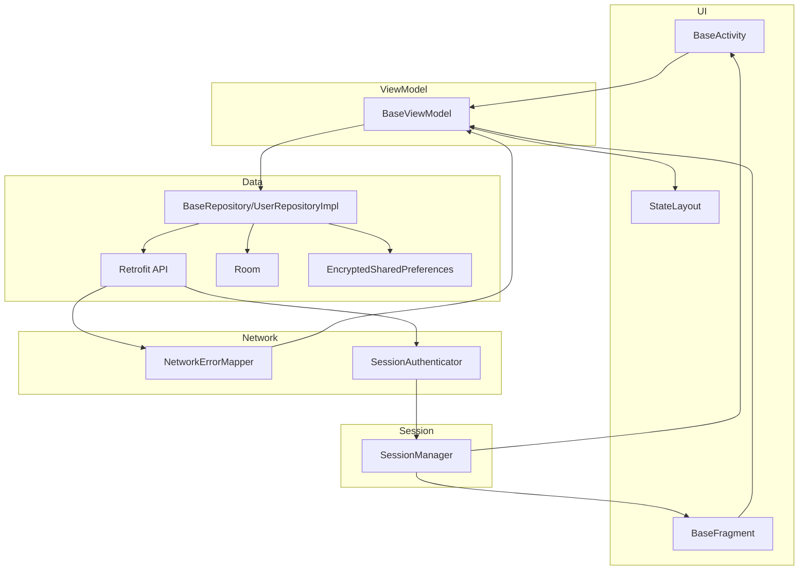

# MVVMFrame

Android MVVM 快速开发框架库（Kotlin），基于 **Jetpack（ViewModel + LiveData）**、**Hilt**、**Kotlin Coroutines**、**Retrofit + OkHttp**、**Room**、**Coil** 等构建，封装了错误处理、会话失效、多状态 UI、安全存储等通用能力。

> 本模块为 **Android Library**。业务 App 需继承 `MvvmFrameApp` 并在 Application 上使用 `@HiltAndroidApp`。

---

## **📥 安装**

支持 **远程依赖（推荐）** 与 **本地依赖** 两种方式，任选其一即可。

---

### **方式一：远程依赖（JitPack）**

从 GitHub 经 JitPack 拉取已发布的 AAR，无需把源码放进业务工程。

**1）添加 JitPack 仓库**

在工程根目录的 `settings.gradle.kts`（或顶层 `build.gradle.kts` 的 `dependencyResolutionManagement` / `allprojects`）中确保包含：

```kotlin
repositories {
    maven { url = uri("https://jitpack.io") }
    google()
    mavenCentral()
}
```

**2）在 App 模块中声明依赖**

```kotlin
dependencies {
    implementation("com.github.sariel20:mvvmframe:v1.0.2")
}
```

---

### **方式二：本地依赖（源码模块）**

将本仓库作为 **Gradle 子模块** 引入，便于调试框架或二次修改。

**1）获取源码**

将 `mvvmframe` 目录放到你的工程旁（或作为子目录克隆），例如：

```text
YourWorkspace/
├── MyApp/                 # 你的 App 工程
└── mvvmframe/             # 本框架仓库根目录（与 MyApp 平级或按你习惯放置）
```

**2）在 App 工程的 `settings.gradle.kts` 中引入模块**

路径按你实际放置位置修改 `file(...)`：

```kotlin
rootProject.name = "MyApp"
include(":app")

include(":mvvmframe")
project(":mvvmframe").projectDir = file("../mvvmframe")   // 与 app 平级时示例；若在工程内子目录则改为 file("mvvmframe")
```

若框架已放在 App 工程根目录下的 `mvvmframe/` 子文件夹，可写为：

```kotlin
include(":mvvmframe")
project(":mvvmframe").projectDir = file("mvvmframe")
```

**3）在 App 模块 `build.gradle.kts` 中依赖本地模块**

```kotlin
dependencies {
    implementation(project(":mvvmframe"))
}
```

## 技术栈


| 类别   | 技术                                          | 说明                   |
| ---- | ------------------------------------------- | -------------------- |
| 语言   | Kotlin 1.9.x                                | 主开发语言                |
| 构建   | AGP 7.4.x、KSP                               | 编译与代码生成（Hilt/Room）   |
| UI   | ViewBinding、Material、AppCompat              | 视图与主题                |
| 架构   | ViewModel、LiveData                          | 状态与生命周期感知            |
| 异步   | Kotlin Coroutines                           | 协程与 `viewModelScope` |
| 依赖注入 | Hilt 2.48.x                                 | 单例与模块划分              |
| 网络   | Retrofit 2.9、OkHttp 4.12、Gson               | REST API 与 JSON      |
| 本地   | Room 2.6                                    | SQLite 与 Flow        |
| 存储   | EncryptedSharedPreferences（security-crypto） | 敏感配置加密               |
| 图片   | Coil 2.5                                    | 图片加载与缓存              |
| 日志   | Timber 5.x                                  | 统一日志入口               |
| 导航   | Navigation 2.7.x                            | 可选页面导航               |
| 其他   | SwipeRefreshLayout                          | 下拉刷新等                |


---

## 架构技术介绍

### 分层职责


| 层次          | 包路径（示意）                                           | 职责                               |
| ----------- | ------------------------------------------------- | -------------------------------- |
| **UI**      | `ui.base`、`ui.common`、`ui.widget`                 | Activity/Fragment 基类、一次性事件、多状态容器 |
| **Domain**  | `domain.model`、`domain.repository`、`domain.error` | 业务模型、仓库契约、结构化错误                  |
| **Data**    | `data.remote`、`data.local`、`data.repository`      | API、Room/SP、Repository 实现        |
| **Network** | `network`                                         | HTTP 异常映射、401 会话处理               |
| **DI**      | `di`                                              | Hilt 模块：网络、数据库、仓库、协程调度           |
| **Core**    | `core.session`、`core.coroutines`、`core.crash`     | 会话、调度器、崩溃入口抽象                    |


### 数据与错误流（要点）

1. **UI** 通过 `BaseActivity` / `BaseFragment` 绑定 `BaseViewModel`，观察 `loading` / `error` / `empty` 等 LiveData。
2. **ViewModel** 调用 **Repository** 的 `suspend` 方法，得到 `Resource<T>`（Success / Error / Loading）。
3. **Repository** 继承 `BaseRepository`，用 `safeApiCall` 统一捕获异常并映射为 `Resource.Error`；业务成功由 `BaseResponse` 判断。
4. **异常** 经 `NetworkErrorMapper` 转为 `AppError`；`BaseViewModel` 可同步到 `appError` 与一次性 `uiEvents`（如带重试的 Snackbar）。
5. **HTTP 401** 由 `SessionAuthenticator` 触发 `SessionManager` 清理登录态并发出会话失效事件；页面可覆写 `onSessionExpired()` 跳转登录。
6. **Token** 等敏感数据经 `PreferencesManager` 使用 **EncryptedSharedPreferences** 存储。

---

## 目录结构

```
mvvmframe/
├── src/main/java/com/lc/mvvmframe/
│   ├── MvvmFrameApp.kt                 # Application 基类（Timber/CrashHandler/Coil）
│   │
│   ├── core/
│   │   ├── session/                    # SessionManager、SessionEvent（会话失效）
│   │   ├── coroutines/                 # DispatcherProvider、DefaultDispatcherProvider
│   │   └── crash/                      # CrashHandler、CrashReporter（崩溃上报抽象）
│   │
│   ├── data/
│   │   ├── local/
│   │   │   ├── db/                     # AppDatabase、UserDao、Converters
│   │   │   └── sp/                     # PreferencesManager（加密 SP）
│   │   ├── remote/api/                 # UserApi 等 Retrofit 接口
│   │   └── repository/                 # BaseRepository、UserRepositoryImpl
│   │
│   ├── di/                             # NetworkModule、DatabaseModule、RepositoryModule、
│   │                                   # CoroutinesModule、SessionEntryPoint
│   │
│   ├── domain/
│   │   ├── error/                      # AppError
│   │   ├── model/                      # BaseResponse、Resource、User、PageData
│   │   └── repository/                 # UserRepository 等接口
│   │
│   ├── network/
│   │   ├── NetworkErrorMapper.kt       # 异常 -> AppError
│   │   ├── NetworkResult.kt            # 网络结果封装（可选）
│   │   └── SessionAuthenticator.kt     # 401 -> SessionManager
│   │
│   ├── ui/
│   │   ├── base/                       # IBaseView、BaseViewModel、BaseActivity、BaseFragment
│   │   ├── common/                     # Event、UiEvent、LoadingDialog
│   │   └── widget/                     # StateLayout
│   │
│   └── util/                           # Extensions、ToastUtils、TimeUtils、NetworkUtils、ContextExt
│
├── build.gradle.kts
└── settings.gradle.kts
```

---

## 思维导图（架构数据流）




---

## 核心类作用说明


| 类 / 文件                           | 作用                                                                                                                                         |
| -------------------------------- | ------------------------------------------------------------------------------------------------------------------------------------------ |
| `MvvmFrameApp`                   | 框架 Application 基类：初始化 Timber、CrashHandler、Coil `ImageLoaderFactory`。                                                                       |
| `IBaseView`                      | View 层契约：`showLoading` / `hideLoading` / `showError` / `showEmpty` / `showToast`。                                                          |
| `BaseViewModel`                  | 统一 `loading`/`error`/`empty`、`appError`、`uiEvents`；协程异常经 `NetworkErrorMapper`；提供 `launch`、`handleResult`、`emitRetryableError`、`runAction`。 |
| `BaseActivity` / `BaseFragment`  | ViewBinding、绑定 ViewModel、观察 LiveData、Snackbar 错误与一次性 `UiEvent`、可选 `StateLayout`、监听 `SessionManager`、可覆写 `onSessionExpired()`。              |
| `Event`                          | 一次性事件包装，避免配置变更重复消费。                                                                                                                        |
| `UiEvent`                        | 如 `ShowError(AppError, retryActionId?)`、`ShowToast`。                                                                                       |
| `AppError`                       | 结构化错误：类型、文案、业务码、可重试、是否需要登录等。                                                                                                               |
| `NetworkErrorMapper`             | 将 `HttpException`、IO、超时等映射为 `AppError`。                                                                                                    |
| `BaseRepository`                 | `safeApiCall`、`responseToResource`，统一 try/catch 与 `BaseResponse` 转 `Resource`。                                                             |
| `UserRepositoryImpl`             | 用户相关网络 + Room + 偏好示例实现。                                                                                                                    |
| `DispatcherProvider`             | 注入 `main`/`io`/`default`，便于测试与替换调度策略。                                                                                                      |
| `SessionManager`                 | 会话失效时清理登录相关数据并发出 `SessionExpired` 事件。                                                                                                      |
| `SessionAuthenticator`           | OkHttp `Authenticator`：401 时触发 `SessionManager`（不做 refresh token 时需业务自行扩展）。                                                                |
| `SessionEntryPoint`              | Hilt `EntryPoint`，供基类在非 `@AndroidEntryPoint` 场景获取 `SessionManager`。                                                                        |
| `PreferencesManager`             | 基于 EncryptedSharedPreferences 的键值存储（Token、用户 ID 等）。                                                                                        |
| `NetworkModule`                  | 提供 Gson、OkHttp（日志、Token 拦截器、`SessionAuthenticator`）、Retrofit、Api。                                                                          |
| `StateLayout`                    | 可选多状态容器：loading / empty / error / content 与重试回调。                                                                                           |
| `CrashHandler` / `CrashReporter` | 未捕获异常钩子；`CrashReporter` 由 App 接入 Crashlytics/Sentry 等。                                                                                     |


---

## 使用示例

### 1. 在 App 模块启用 Hilt 并继承框架 Application

```kotlin
@HiltAndroidApp
class App : MvvmFrameApp() {
    override fun onCreate() {
        super.onCreate()
        // 可选：接入崩溃上报
        // CrashHandler.reporter = CrashReporter { t -> FirebaseCrashlytics.getInstance().recordException(t) }
    }
}
```

### 2. Activity：三态 View 或 StateLayout

```kotlin
@AndroidEntryPoint
class MainActivity : BaseActivity<ActivityMainBinding, MainViewModel>() {

    override fun createBinding() = ActivityMainBinding.inflate(layoutInflater)

    override fun createViewModel(): MainViewModel = hiltViewModel()

    override fun initView() {
        // 方式 A：loading / empty / content 三个 View
        setLoadingViewRef(binding.layoutLoading)
        setEmptyViewRef(binding.layoutEmpty)
        bindContentView(binding.layoutContent)

        // 方式 B（可选）：StateLayout 统一管理多状态
        // bindStateLayout(binding.stateLayout) { viewModel.loadData() }
    }

    override fun initData() {
        viewModel.loadData()
    }

    override fun onSessionExpired() {
        // 跳转登录页、清栈等
    }
}
```

### 3. ViewModel：Resource 与可选重试

```kotlin
@HiltViewModel
class MainViewModel @Inject constructor(
    private val userRepository: UserRepository
) : BaseViewModel<IBaseView>() {

    fun loadData() {
        launch {
            when (val r = userRepository.getUserInfo()) {
                is Resource.Success -> { /* 更新 UI LiveData */ }
                is Resource.Error -> {
                    // 需要重试时：
                    // emitRetryableError(NetworkErrorMapper.fromThrowable(r.exception!!)) { loadData() }
                }
                is Resource.Loading -> {}
            }
        }
    }
}
```

### 4. Repository：继承 BaseRepository

```kotlin
@Singleton
class MyRepositoryImpl @Inject constructor(
    private val api: MyApi,
    private val dispatchers: DispatcherProvider,
) : BaseRepository(), MyRepository {

    override suspend fun fetch(): Resource<Data> = withContext(dispatchers.io) {
        safeApiCall { api.getData() }
    }
}
```

---

## License

MIT License